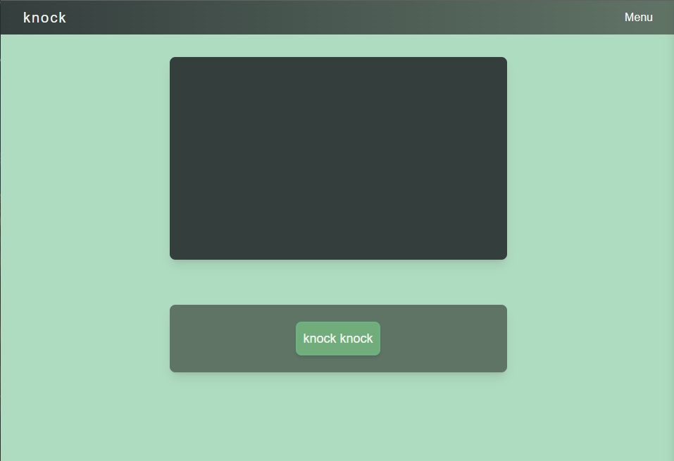
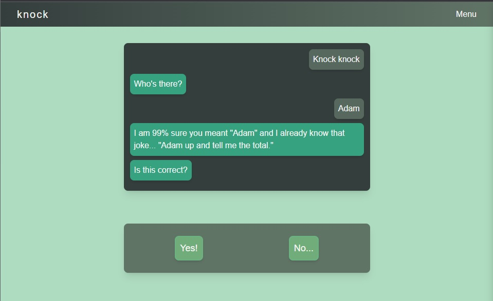
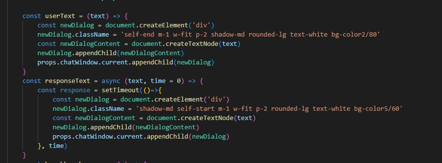
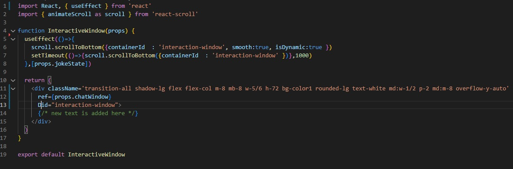
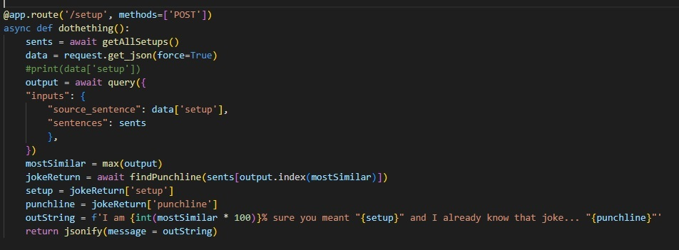

# Knock-Knock

### Who's there?

Knock-Knock is here to guess who might be at the door. Knock-Knock takes user input and attempts to interject the answer to the knock-knock jokes before you can. How rude.

## Table of Contents
-[Technology](#technology)  
-[Screenshots](#screenshots)  
-[Planning Docs](#planning-docs)  
-[User Stories](#user-stories)  
-[Goals](#goals)  
-[Closing Thoughts](#closing-thoughts)  

## Technology

#### Front End
* NextJS  
* TailwindCSS  
* HeadlessUI  
* React-Scroll  
* Firebase (Authentication)
* Deployed with Vercel  

#### Back End
* Python
* Flask
* HuggingFace Sentence Transformers (<a href="https://huggingface.co/sentence-transformers/all-MiniLM-L6-v2">all-Mini-L6-v2</a>)
* MongoDB via PyMongo
* Deployed with Heroku

## Screenshots

 Main Screen 

This is the main screen on load

 In Progress 

This is the app in progress

 Functions to add text to chat window 

These are the functions to add text into the dialog box. These are called in several places to add new text content

 Chat window base code 

This is the container where text is added using useRef

Backend Functionality

This is the function doing a lot of the heavy lifting on the backend. It:  
1) Pulls all setups from the db  
2) Compares them to the incoming joke setup using the sentence transformer/vector search mentioned in technology
3) It returns the 'most similar' value  

## Planning Docs

  

    Site Flow
  

  
ERD

  

  
Wireframe

  

## User Stories
* User opens the page and clicks on a 'Knock-Knock' button to intiate interaction: "Knock, Knock", "Who's there?", __________
* User inputs the first response and the site returns a guess as to how the joke might finish.
* If the computer response is incorrect, it will try one additional guess.
* If both are incorrect, the user is prompted to submit the correct answer, which is then added to the knock knock jokes database.
* NOTE: Validating the joke a second time ended up being pretty complex. I'll add it as a future goal.

## Goals
| Goals | When? |
|-------|-------|
| Backend research | Done |
| HuggingFace(hf) research | Done |
| Setup JokeDB | Done |
| Setup HF Interaction | Done |
| Backend Deployment | Done |
| Basic frontend setup | Done |
| front/back interaction | Done |
| Frontend styling | Done |
| Firebase Integration | Done |
| Authentication | Actively Debugging |
| Condiontal Returns * | Soon |
| Sessions Based on Firebase Login | Soon |
| Input filtering | Stretch |
| Multiple Joke Guesses | Later |

* Conditional returns based on calculated relevance would make the interaction feel more authentic. Plan is to skip guessing if the calculated accuracy is below n%.

## Closing Thoughts

Could I have done this in React using fuzzy searches and achieved the current state of the application? 

Yes... But my goal is to continue to build this app out to auto complete longer jokes (or add them to the database). If I get to that point and realize that I still could've done so without lifting so much tech, then I'll refactor the app.

